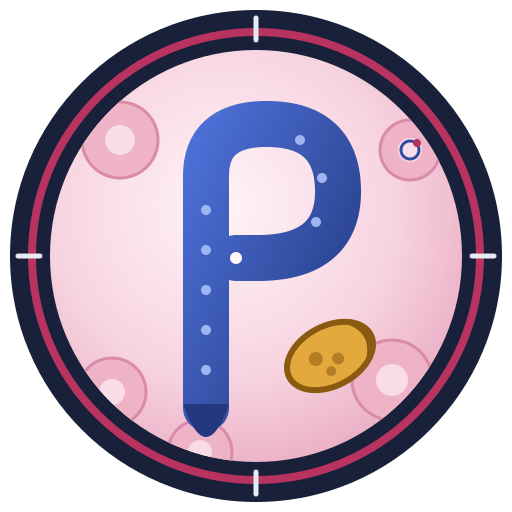

# Parasitology Contest

เว็บฝึกทำข้อสอบ Parasitology Contest จากข้อสอบที่รวบรวมได้ปี 2021–2025 เป็นไฟล์ HTML ไฟล์เดียว ไม่ต้องติดตั้งอะไร

## เปิดใช้

- เปิด `index.html` ในเบราว์เซอร์ได้เลย
- หรือเปิด GitHub Pages: Settings → Pages → Source: `main` / root แล้วเข้าที่ลิงก์ที่ได้ (ถ้า repo เป็น private ต้องใช้แพ็กเกจ GitHub ที่รองรับ Pages แบบ private)

## มีอะไรบ้าง

- **ฝึกพิมพ์ตอบ** 175 ข้อ แบ่ง 7 บท มีเฉลยและคำอธิบาย บอกว่าข้อไหนออกปีไหน กรองตามปีได้
  - Basic Parasitology · General knowledge · Protozoa · Cestode/Acanthocephalans · Trematode · Nematode · Arthropods
- **Flashcards** ทบทวนแบบ spaced repetition (แบบ Anki)
- **สรุปเนื้อหา** รายบท พร้อมรายการข้อที่ออกซ้ำหลายปี
  - ภาพจุลทรรศน์จริง 39 รูป: มาลาเรียทั้ง 4 ชนิด, Babesia, Leishmania, T. cruzi, ไข่พยาธิที่ออกสอบ, ยุง 3 สกุล
  - แผนภาพ 5 ภาพ: วิธีตรวจ, ขนาดไข่ตามสเกลจริง, scolex/proglottid ของ Taenia, หางไมโครฟิลาเรีย, ท่าเกาะของยุง

ความคืบหน้าการทำข้อสอบเก็บไว้ในเบราว์เซอร์เครื่องที่ใช้ (localStorage) จึงไม่ข้ามเครื่องหรือข้ามเบราว์เซอร์

## ไฟล์

| ไฟล์ | คืออะไร |
|---|---|
| `index.html` | ตัวเว็บทั้งหมด (ข้อสอบ ภาพ และโค้ดฝังอยู่ในไฟล์นี้) |
| `data/questions.json` | ข้อสอบทั้งหมดในรูป JSON ไว้อ่านหรือแก้ไข (`ch` บท, `y` ปีที่ออก, `q` คำถาม, `a` เฉลย, `ex` คำอธิบาย) |

## หมายเหตุ

- ข้อสอบมาจากการ recall ของนักศึกษา บางข้อมีกล่องเตือนว่าเฉลยยังไม่แน่นอน ควรตรวจกับเฉลยจริงถ้ามี
- ที่มาของภาพ: [Microscopic-Medical-Parasitology-Classification](https://github.com/sayedgamal99/Microscopic-Medical-Parasitology-Classification), [MP-IDB](https://github.com/andrealoddo/MP-IDB-The-Malaria-Parasite-Image-Database-for-Image-Processing-and-Analysis), [csbl-br/chagas_detection](https://github.com/csbl-br/chagas_detection), CDC PHIL / James Gathany (public domain) และ Wikimedia Commons ใช้เพื่อการศึกษา
